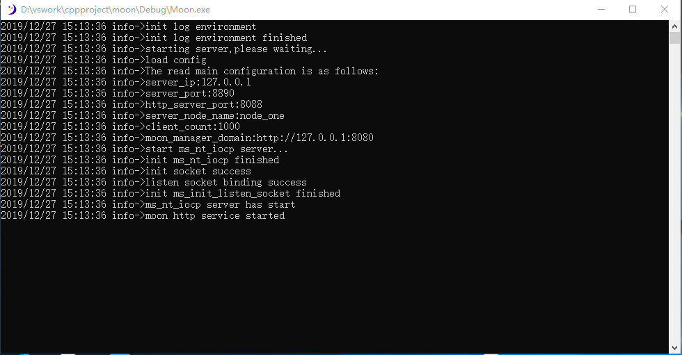
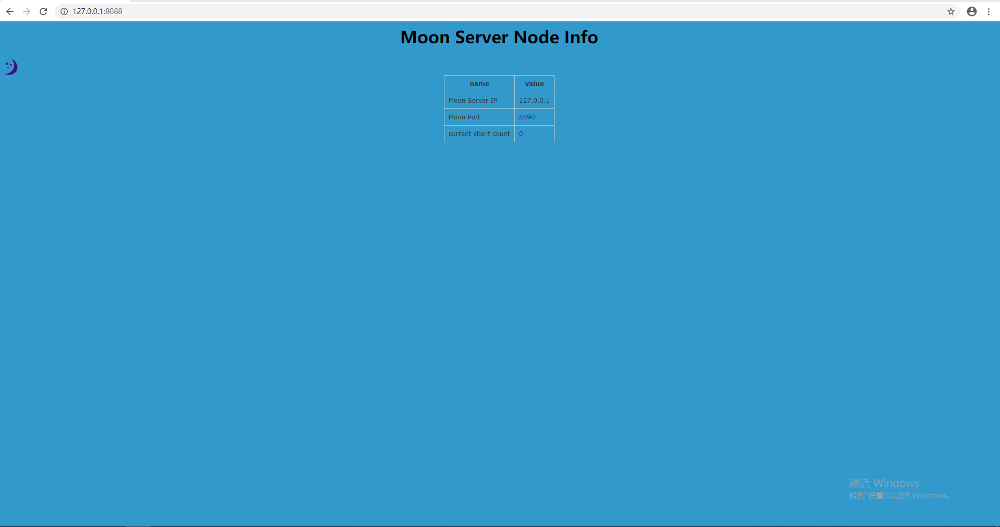

# moon 说明
moon高性能跨平台网络即时通讯，moon采用c语言在不同平台最优的socket编程，如windows的iocp模型，目前暂时实现了windows平台， 
Linux平台后期会慢慢更新，包括集群也会慢慢更新。
# 使用方式
##源码编译
下载源代码：git clone https://github.com/lengkristy/moon.git，然后使用vs打开进行编译。
##控制台信息

控制台信息可以看到客户端连接IP:PORT，包括http服务的端口，http服务主要是用于查看当前服务的状态信息。
##http服务节点信息
我们通过浏览器可以访问：http://127.0.0.1:8088，如图所示： 

##开发包
我们提供了C/C++、.NET、JAVA语言的开发包
###.NET开发包
通过引用dll包文件便可调用我们提供的API即可通信。

#项目完善中，个人精力有限，期待你的加入QQ：670868521